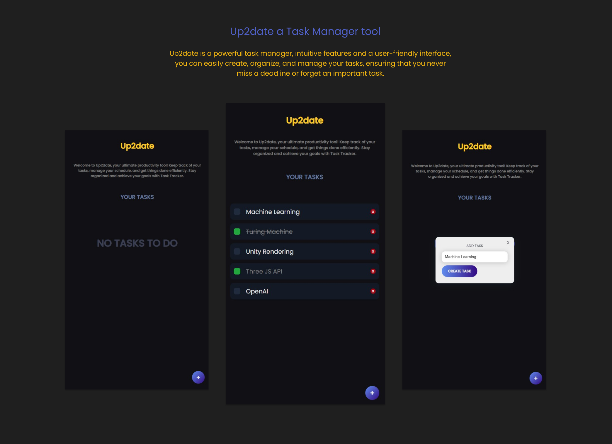

# Up2date 📟
```
React JS and MongoDB based Task Manager app.
```

<p>
  <b>
    Up2date is a powerful task manager tool designed to help you stay on top of your daily to-do lists.<br> 
    With intuitive features and a user-friendly interface, you can easily create, organize, and manage your tasks, 
    ensuring that you never miss a deadline or forget an important task. 
  </b>
</p>


<br>

```
Install dependencies:
npm install

Run React dev server (http://localhost:3000)
npm start

Run Mongodb server (http://mongodb://127.0.0.1:27017)
npm start
```

<div float="right" width="800" height="700">
  
</div>

